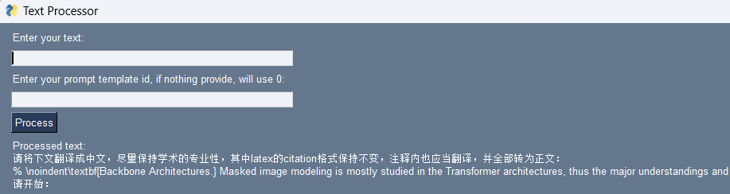

# Simple GUI for Efficiency

修改 useful_prompt.txt 中的内容即可添加 prompt 的模板；以两个空行作为分隔。

```bash
pip install -r requirements.txt
```
在命令行运行
```bash
python ./chatgui.py
```
即可运行 gui  
输入待翻译的文本和选用的prompt_id(可以不输，默认为第0个)，按回车键，会将apply prompt之后的内容复制到剪贴板，即可复制到chatgpt。


